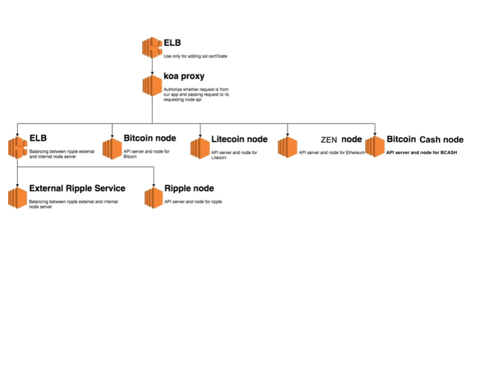

# cp-platform-infrastructure
Using HCL configuration language to define and manage crypto platform in IAC manner.

# Legacy crypto architecture
We want to refactor the legacy architecture like below into infrastructure as code.

